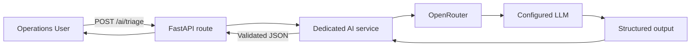
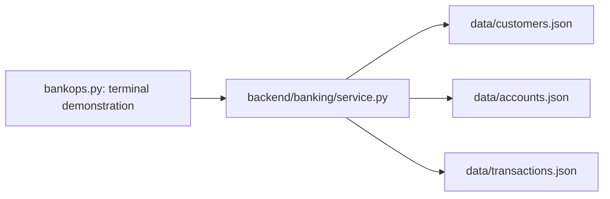

# BankOps AI

AI-Powered Banking Payment Investigation Assistant ? an incremental learning project using synthetic data only.

## Learning questions and lessons learned

Each implemented phase has a companion Q&A covering the concepts requested in its brief, professional explanations, and practical lessons from building and troubleshooting the project.

| Phase | Prerequisite questions and lessons learned | Implementation guide |
| --- | --- | --- |
| 1 - Python and JSON | [Python, data relationships, error handling, and terminal lessons](docs/phase-1-qna.md) | [Phase 1 guide](docs/phase-1-guide.md) |
| 2 - Banking REST APIs | [FastAPI, HTTP, JSON, REST, OpenAPI, Swagger, and API design lessons](docs/phase-2-qna.md) | [Phase 2 guide](docs/phase-2-guide.md) |
| 3 - LLM integration | [LLM fundamentals, prompts, structured outputs, provider errors, and testing lessons](docs/phase-3-qna.md) | [Phase 3 guide](docs/phase-3-guide.md) |

Phase 1 questions are derived from its requirements and follow-up discussion; Phases 2 and 3 cover the explicitly requested prerequisite topics. Read each question, attempt an answer, then compare with the explanation. Lessons distinguish observed results from assumptions and unverified live behavior.

For each future phase, add its actual prerequisite questions and answers, implementation lessons as Q&A, and a learning checkpoint when that phase is undertaken. Phases 4-12 remain planned; no completion or lessons are claimed for them.

### Phase 1: Python and JSON

#### Prerequisite questions and professional answers

| Question | Professional answer |
| --- | --- |
| What are we building with Python and JSON? | We are building a small read-only banking service. JSON files store fictional customers, accounts, and transactions; Python functions retrieve records and related collections. This establishes deterministic data access before introducing an HTTP interface or an LLM. |
| What is JSON, and how does Python use it? | JSON is a language-independent text format for structured data. A JSON array becomes a Python list, and each JSON object becomes a dictionary. `json.load(file)` reads JSON from a file; `json.dumps(value)` converts a Python value into JSON text. A dictionary supports field access such as `transaction["status"]`. |
| Why separate JSON data from lookup code? | Data and behavior change for different reasons. Separating them allows records to change without editing lookup functions, makes testing easier, and gives future storage changes a clear boundary. Replacing JSON with a database would still require implementation work, but callers could retain familiar service interfaces. |
| How do we verify that a transaction belongs to the correct customer? | Find the account referenced by the transaction's account_id, confirm that the account exists, and compare its customer_id with the transaction's customer_id. Then confirm that the customer exists. For example, TXN001 refers to ACC001, which belongs to CUST001. Tests also check unique identifiers and currency consistency. These checks establish data integrity, not permission for a logged-in user to access a record. |
| Why return None for a missing record but [] for a collection? | A single-record lookup promises one record or its absence, represented by None. A collection lookup promises a list; zero matches are represented by an empty list. Consistent return contracts simplify calling code. At the service layer, an unknown parent also produces an empty collection; the HTTP layer later adds explicit parent-existence checks. |
| How does a missing transaction differ from a damaged JSON file? | A missing transaction means a valid dataset was searched successfully and contained no matching ID. Damaged or unreadable JSON means the search could not be completed. Returning None for both would hide operational failures. The service returns None for absence and raises BankingDataError for a loading failure. |
| Why store money as integer minor units? | Binary floating-point values cannot represent every decimal fraction exactly. Integer minor units avoid that problem for stored amounts. In the supported two-decimal currencies, 250000 minor units represents 2500 whole units. Currency-specific rules must be considered before expanding this convention to other currencies. |
| Why cannot PROCESSING alone explain a payment delay? | A status describes a state, not the full history or cause. PROCESSING does not establish which step is waiting, whether a deadline has passed, or whether the beneficiary received funds. A defensible explanation would require additional evidence such as events and timestamps. This phase retrieves facts without making that inference. |
| What are modules, packages, and imports? | A Python file is a module. An __init__.py file marks a regular package containing related modules. An import makes a module's functions available in another execution context. Importing get_customer does not execute a lookup; calling get_customer("CUST001") does. |

#### Lessons learned: practical Q&A

| Question | Professional answer |
| --- | --- |
| Why did PowerShell reject the word from? | Python import syntax was entered into PowerShell. A prompt beginning with PS accepts shell commands. Start Python with `python`, wait for `>>>`, then enter the import and function call. Activating `.venv` selects a Python environment but does not start the interpreter. |
| How do I run a Python lookup directly from PowerShell? | Use Python's `-c` option and print the result. This executes Python code without opening an interactive interpreter. |
| What does $LASTEXITCODE mean? | It is PowerShell's stored exit code from the last native program. In our terminal demonstration, 0 means a successful lookup, 1 means a missing transaction, and 2 means an argument or banking-data error. These values describe process completion; they are not HTTP status codes. |
| Why resolve data paths relative to the service file? | The terminal's current folder can vary. Resolving the data directory from __file__ makes data loading depend on the project's layout rather than where a caller happens to run Python. The module still needs to be importable by the caller. |
| What did our integrity tests establish, and what did they not establish? | They checked the supplied synthetic fixtures: record counts, unique IDs, valid links, supported values, and expected lookup behavior. They did not implement full validation for arbitrary imported data, account balances, settlement, or double-entry accounting. Test scope should be stated explicitly. |

Examples and learning checklist: [Phase 1 Q&A](docs/phase-1-qna.md).

### Phase 2: Banking REST APIs

#### Prerequisite questions and professional answers

| Question | Professional answer |
| --- | --- |
| What is FastAPI? | FastAPI is a Python framework for building HTTP APIs. It maps methods and URL paths to Python functions and integrates validation and API documentation. In BankOps, the route accepts an identifier, calls the banking service, and returns an HTTP response. Uvicorn is the server that listens for incoming connections and runs the application. |
| Why does an AI application need APIs? | An AI application often needs a defined interface for obtaining facts from other systems. An API lets a caller request a transaction without knowing how it is stored. It also creates a place to introduce authentication, validation, and access policies later. Not every AI application requires HTTP APIs: a local Python program can call functions directly. We introduced HTTP to establish a reusable system boundary. |
| What is a request, and what is a response? | An HTTP request contains a method, URL, headers, and optionally a body. The response contains a status code, headers, and optionally a body. For example, GET /transactions/TXN001 asks for a transaction; a successful response contains HTTP 200 and a JSON representation of that record. |
| What is the difference between GET and POST? | GET retrieves a resource and should not request a change to application state. POST submits data for processing or creation. Phase 2 uses GET for banking lookups. Phase 3 uses POST to submit a complaint for classification. A POST operation does not necessarily create a database record. Sensitive data should not be assumed safe merely because it is in a POST body; transport security and handling policies are separate concerns. |
| What do HTTP status codes tell a client? | Status codes communicate the outcome at the HTTP boundary. BankOps uses 200 for successful retrieval, 404 for an unknown resource, 405 for an unsupported method, 422 for invalid request input, and 500 for server-side data failures. A caller should inspect both the code and the documented response body. HTTP status does not establish whether a payment itself succeeded. |
| What is JSON in an API? | JSON is the serialized representation exchanged between client and server. Python dictionaries and lists become JSON objects and arrays in the response body. A Pydantic model describes the expected fields and types; it is separate from the serialized JSON and from a database table. The response typically identifies its format with Content-Type: application/json. |
| What is REST? | REST is an architectural style organized around resources, representations, and a uniform interface. Our API applies resource-oriented URLs and standard HTTP methods: /customers/CUST001 identifies a customer, and /customers/CUST001/accounts identifies its account collection. Requests are independent rather than relying on a conversational session. Using JSON alone does not make an API RESTful. |
| What are OpenAPI and Swagger? | OpenAPI is a machine-readable API description specifying paths, operations, parameters, schemas, and responses. Swagger UI renders that description as an interactive browser interface. In this project, /openapi.json serves the specification and /docs serves Swagger UI. The documentation is generated from the route and model declarations, but actual behavior still needs testing. |

#### Lessons learned: practical Q&A

| Question | Professional answer |
| --- | --- |
| Why keep the route separate from the banking service? | The route translates HTTP concerns: path parameters, status codes, and serialization. The service handles banking lookups and file access. This keeps the service usable from both the terminal and API and avoids coupling data logic to a web framework. |
| Why check the parent before returning an account or transaction collection? | An unknown customer is different from a known customer with no accounts. The route checks existence so the first case returns 404 and the second returns 200 with []. The same rule applies to account transactions. This adds HTTP meaning without changing the original service return contract. |
| Why is invalid stored output a 500 rather than a 422? | A response-model failure means the server could not fulfill its promised output contract. That is a server-side error. A request-validation failure means the client submitted input that does not satisfy the input contract and receives 422. Identifying which side violated the contract improves diagnosis. |
| Why can curl finish successfully while displaying HTTP 404? | The command may have successfully exchanged an HTTP request and response even though the requested resource was absent. Its process exit code and the HTTP response status measure different things. Use `curl.exe -i` to inspect response headers and status rather than relying only on $LASTEXITCODE. |
| Why do API tests not require a running Uvicorn server? | TestClient exercises the application in the test process. This makes route and response-contract testing repeatable without managing a listening server. A separate live-server smoke check verifies startup and actual HTTP access; neither kind of test replaces the other entirely. |
| Does /health prove the data and AI provider are available? | No. It is a liveness endpoint confirming that the application can respond. It does not validate every JSON file or call an external provider. A readiness check would have a different purpose and must be designed explicitly. |

Examples and learning checklist: [Phase 2 Q&A](docs/phase-2-qna.md).

### Phase 3: LLM integration

#### Prerequisite questions and professional answers

| Question | Professional answer |
| --- | --- |
| What is an LLM? | A Large Language Model is a trained model that processes token sequences and generates likely continuations based on patterns learned during training and the supplied context. It can interpret language, classify complaints, and extract fields. It is not a transaction database and does not automatically access our JSON records. In this phase, its output reflects the user's statement rather than verified banking evidence. |
| What is a prompt? | A prompt is the instructions and context supplied for a model request. Our request contains an extraction task, the Operations complaint, and a response schema. Good prompting defines the scope, allowable classifications, treatment of missing information, and prohibited inferences. Prompt instructions alone are not a guarantee that the model will follow every rule. |
| What is a system prompt? | The system prompt contains application-controlled instructions setting the task and boundaries. Our instructions restrict the model to classification and extraction and tell it not to investigate, recommend actions, or invent facts. Keeping these instructions separate from user content makes their roles explicit. This separation does not by itself eliminate prompt-injection risks. |
| What is a user prompt? | The user prompt is the Operations message being processed. It may contain reported facts, ambiguities, or instructions that conflict with the application's task. We treat the complaint as input data. For example, the statement that TXN001 was debited is a claim to extract, not an independently established fact. |
| What are tokens? | Tokens are the units of text processed by the model: they may be words, fragments, punctuation, or other text segments. Token counts affect request size, latency, and usage charges where applicable. A 4,000-character input limit is not a 4,000-token limit; different text can tokenize differently. |
| What is a context window? | The context window limits how much token context a model can handle for a request, including input and generated output within the model's rules. Input can include instructions, messages, and schemas. BankOps sends one complaint per request without conversation history. A large context window does not guarantee accurate interpretation. |
| What is temperature? | Temperature adjusts the sampling distribution used during generation. Lower values generally reduce variation; higher values allow more varied choices. We use 0 for extraction. It does not guarantee correctness, eliminate hallucinations, or ensure identical results across all requests and provider implementations. |
| What is hallucination? | A hallucination is generated information that is unsupported or incorrect in the task's context. Examples include inventing an amount, guessing AED from a UAE location, or claiming a delay was caused by a compliance review. Our prompt instructs the model to use null for missing or ambiguous fields. Semantic checks and evaluation remain necessary even when the response has valid JSON structure. |
| What is structured output? | Structured output constrains a model response to a defined schema. BankOps supplies a Pydantic TriageResult through the SDK's parse method, which sends a JSON schema and parses the returned data. This is stronger than asking for JSON in prose and then searching the response for braces. Schema validation checks shape and allowed values; it cannot establish that the model extracted the correct facts. Refusals and incomplete responses also require explicit handling. |

#### Lessons learned: architecture Q&A

| Question | Professional answer |
| --- | --- |
| Why use a dedicated AI service? | The AI service owns provider configuration, prompting, request parameters, parsing, and provider-error translation. The route validates HTTP input and returns HTTP results. This separation makes provider changes and mocked tests possible without embedding SDK logic in API routes. |
| How do OpenRouter, the OpenAI SDK, and the model differ? | OpenRouter is the gateway receiving our request and routing it to a model provider. The OpenAI Python SDK is the client library used because OpenRouter exposes a compatible interface. The selected model performs the language task. Using this SDK does not mean the request is sent directly to OpenAI: our configured base URL points to OpenRouter. |
| Why did the model change during Phase 3? | The project first integrated OpenAI, then switched to OpenRouter at the user's request. A live check of the selected Qwen free endpoint returned an explicit upstream provider rate-limit message. The user subsequently selected Nex-N2.5-Mini. Offline tests verified the request configuration for the replacement, but those tests did not establish its live availability or extraction quality. |
| Why use null for missing details? | Null explicitly represents unknown information. Filling an absent amount with zero or guessing a currency would turn missing evidence into a false claim. All four result keys are present, but transaction_id, amount, and currency may be null. Our narrow issue categories are payment_not_received, other, and unclear. |
| Why can the AI extract TXN999 when no such record exists? | Extraction identifies text in the complaint. Lookup checks a data source. Phase 3 implements extraction only, so it should preserve an explicitly reported ID even when it is absent from the synthetic dataset. This distinction prevents an extraction result from being mistaken for an investigation. |
| Why does AI output use amount 2500 while banking data uses 250000? | The extraction contract uses whole currency units to match the user's statement. The banking dataset uses integer minor units for precise storage. No financial calculation occurs in the AI service. Any future connection between the two must validate currency, precision, and conversion explicitly rather than mixing the values directly. |

#### Lessons learned: troubleshooting Q&A

| Question | Professional answer |
| --- | --- |
| Why did editing .env.example not configure the application? | .env.example is a shareable template. The service reads .env and process environment variables. A real key belongs only in the ignored local .env file or a suitable secret-management mechanism. Existing process variables take precedence because dotenv is loaded with override=False. |
| Why can a restart or clearing a terminal variable matter? | A running process can retain an earlier environment value. Editing .env does not replace a nonempty process variable under the current loading policy. Stop the server, clear the specific terminal override when appropriate, and restart. Do not print the key to diagnose the problem. |
| What did the initial generic 503 hide? | The initial handler grouped rejected credentials and rate limits together. Splitting upstream 401 from 429 made diagnosis more precise. The public API still returns 503 because the AI dependency is unavailable; the safe detail identifies the upstream status. A local HTTP status and a provider HTTP status describe different boundaries. |
| What did we learn from the repeated 429 responses? | A 429 can originate from platform request limits or provider capacity. In the observed diagnostic check, the key-status endpoint accepted the key and reported 0 daily requests used with 50 remaining. A separate synthetic generation request then identified the Qwen provider's temporary upstream rate limit. That evidence identified the incident's cause; the same diagnosis should not be assumed for every future 429. |
| Why did zero dashboard activity not resolve the diagnosis? | The screenshot showed a filtered view, not complete evidence of every attempted request. The filter might refer to a different key, and a rejected request might not appear as completed usage. We did not establish the dashboard's precise counting behavior. Direct response evidence was more useful than inferring success or failure from a blank usage summary. |
| Why did a $100 key limit not prove that requests should work? | A key spending cap, account credit balance, daily request allowance, and provider capacity are different constraints. Raising a spending cap does not necessarily change a free endpoint's request limits or available capacity. Diagnosis should identify the failing constraint before changing account settings. |
| How can errors be useful without exposing secrets? | Use controlled error messages, documented metadata, and narrowly validated headers such as numeric retry delays. Do not echo arbitrary raw provider bodies, request headers, or exception strings to callers. Our tests exercise error responses with secret-like placeholders to check that those values are not returned or logged by the tested paths. |
| What should happen if a key is exposed? | Revoke the exposed key, issue a replacement, update local configuration, and restart the application. Removing a key from a later message or file does not undo exposure. Git ignore rules prevent ordinary tracking of .env, but do not protect keys copied into screenshots, chat, another tracked file, or existing history. |
| What do mocked tests prove, and what requires a live call? | Mocks verify input validation, request parameters, SDK schema handling, error mapping, and API behavior without invoking the provider. A real-SDK test with a mocked HTTP transport also verifies serialization and parsing. Live tests are needed to check actual credentials, provider availability, schema acceptance, and model extraction behavior. One successful live example is still not a comprehensive accuracy evaluation. |
| Why disable reasoning and avoid a second conversational call? | Our task is a small, independent extraction request. A two-turn conversation with preserved reasoning details adds state and complexity without being required by the phase objective. The implementation requests disabled reasoning and retains the four-field schema. This is an implementation choice for this milestone, not a claim that reasoning is never useful. |

Examples and learning checklist: [Phase 3 Q&A](docs/phase-3-qna.md).

## Phase 3: LLM classification and extraction

`POST /ai/triage` classifies a synthetic complaint and extracts transaction_id, amount, and currency using OpenRouter structured outputs. It does not investigate or query banking records. See the [Phase 3 guide](docs/phase-3-guide.md) for concepts, local key setup, Swagger/PowerShell examples, and mocked versus live tests.

Copy `.env.example` to `.env` only if absent, enter your key locally, and install the updated requirements. Never commit or share `.env`. Banking endpoints still work without a key. Default tests do not make paid calls; the live test requires explicit opt-in.

## OpenRouter integration

OpenRouter connects the AI service to the configured language model through an OpenAI-compatible API. The project uses the `openai` Python SDK with base URL `https://openrouter.ai/api/v1`; requests go to `/chat/completions`. An OpenRouter key is required, rather than a direct OpenAI key.

The configured default model is `nex-agi/nex-n2.5-mini:free`. Model availability and provider limits can change. Keep a model that supports JSON-schema structured output when changing this setting.



### Local setup

Run from the project root in PowerShell. Create the virtual environment if it does not already exist:

```powershell
if (!(Test-Path .venv)) { python -m venv .venv }
.\.venv\Scripts\python.exe -m pip install -r requirements-dev.txt
if (!(Test-Path .env)) { Copy-Item .env.example .env }
```

Create an API key in your OpenRouter account. Open `.env` locally and configure:

```dotenv
OPENROUTER_API_KEY=your_openrouter_key_here
OPENROUTER_MODEL=nex-agi/nex-n2.5-mini:free
```

Replace the placeholder only in `.env`. Keep `.env.example` free of credentials. Git ignores `.env`; never paste keys into chat, screenshots, source code, or commits. If a key is exposed, revoke and replace it.

The service loads `.env` with `python-dotenv`. Existing terminal environment variables take precedence. Restart the server after changing configuration:

```powershell
.\.venv\Scripts\python.exe -m uvicorn backend.main:app --reload --host 127.0.0.1 --port 8000
```

### Test triage

Open http://127.0.0.1:8000/docs and use **POST /ai/triage**, or send this request from a second PowerShell terminal:

```powershell
$body = @{ message = 'Customer reports that transaction TXN001 for AED 2,500 was debited but the beneficiary has not received the payment.' } | ConvertTo-Json
Invoke-RestMethod -Method Post -Uri 'http://127.0.0.1:8000/ai/triage' -ContentType 'application/json' -Body $body | ConvertTo-Json
```

Expected extraction:

```json
{
  "issue_type": "payment_not_received",
  "transaction_id": "TXN001",
  "amount": 2500,
  "currency": "AED"
}
```

This describes the complaint, not verified banking facts. Amount uses whole currency units in this response; banking records use integer minor units. Unknown or ambiguous extracted fields may be `null`.

### Implementation and tests

- `backend/ai/routes.py` handles HTTP input and safe error responses.
- `backend/ai/service.py` sends separate system instructions and user content using `client.chat.completions.parse()`.
- `backend/ai/models.py` supplies the Pydantic response schema. The SDK returns parsed structured data rather than arbitrary prose.
- The request requires provider support for its parameters, disables reasoning for this basic extraction task, caps output at 500 tokens, and uses a 30-second timeout with no automatic retries.
- The service does not query banking records, investigate causes, or execute tools.

Run offline tests without credentials or provider calls:

```powershell
.\.venv\Scripts\python.exe -m pytest -q -m "not live"
```

Mocks verify application behavior and SDK schema handling; they do not prove model accuracy or live availability. To explicitly run the real-provider example:

```powershell
$env:RUN_LIVE_LLM_TESTS = '1'
.\.venv\Scripts\python.exe -m pytest -q -m live
Remove-Item Env:RUN_LIVE_LLM_TESTS
```

Live calls consume provider quota and may incur charges depending on the configured model. A model name ending in `:free` does not guarantee available capacity.

### OpenRouter troubleshooting

| Symptom | Meaning / next step |
| --- | --- |
| 503: key not configured | Set `OPENROUTER_API_KEY` in `.env`, not `.env.example`. |
| 503 with upstream 401 | OpenRouter rejected the supplied key; check the local configuration and restart. |
| 503 with upstream 429 | Account or provider rate/capacity limit; follow any reported retry delay. Changing a spending cap does not necessarily resolve request limits. |
| 504 | Provider request timed out. |
| 502 | Provider request failed or returned an incomplete/invalid structured result. |
| 422 | Invalid input or model refusal. |

If an old terminal value overrides `.env`, stop the server and remove the overrides before restarting:

```powershell
Remove-Item Env:OPENROUTER_API_KEY -ErrorAction SilentlyContinue
Remove-Item Env:OPENROUTER_MODEL -ErrorAction SilentlyContinue
```

These commands do not delete `.env`. Error handling uses safe messages and selected metadata rather than exposing raw provider responses or credentials.

References: [OpenRouter SDK integration](https://openrouter.ai/docs/guides/community/openai-sdk), [structured outputs](https://openrouter.ai/docs/guides/features/structured-outputs), [rate limits](https://openrouter.ai/docs/api/reference/limits).

## Phase 2: Banking REST APIs

The JSON banking service is now accessible through FastAPI. Start here: [Phase 2 learning guide](docs/phase-2-guide.md).

Run in **PowerShell**, from the project root (exit the Python `>>>` prompt first):

```powershell
.\.venv\Scripts\python.exe -m pip install -r requirements-dev.txt
.\.venv\Scripts\python.exe -m uvicorn backend.main:app --reload --host 127.0.0.1 --port 8000
```

Open http://127.0.0.1:8000/docs for Swagger UI. Use a second terminal for commands and tests; stop the server with Ctrl+C.

```powershell
curl.exe -i http://127.0.0.1:8000/transactions/TXN001
.\.venv\Scripts\python.exe -m pytest -q
```

All routes are GET: `/health`, `/customers/{customer_id}`, `/customers/{customer_id}/accounts`, `/accounts/{account_id}`, `/accounts/{account_id}/transactions`, `/transactions/{transaction_id}`.

Missing resources (including parents of collections) return 404. Existing parents with no children return 200 and `[]`. Broken backing data returns 500. `/health` is application liveness, not a data readiness check. This is a local synthetic-data learning API; authentication is not implemented in this phase.

New files: `backend/main.py`, `backend/banking/routes.py`, `backend/banking/models.py`, `requirements.txt`, `tests/test_api.py`, and the Phase 2 guide. Development dependencies now include runtime dependencies and HTTPX for API tests. The Phase 1 demonstration still works.

## Phase 1: Python and JSON banking system

This milestone contains 10 fictional customers, 15 accounts, and 50 transactions. The service retrieves facts; it does not investigate causes or move money. Runtime code uses only the Python standard library. Use Python 3.10 or newer.



The current folder is the project root (the `bankops-ai/` folder in the requested layout).

```text
bankops-ai/
??? README.md
??? bankops.py
??? backend/
?   ??? __init__.py
?   ??? banking/
?       ??? __init__.py
?       ??? service.py
??? data/
?   ??? customers.json
?   ??? accounts.json
?   ??? transactions.json
??? docs/
?   ??? phase-1-guide.md
??? tests/
?   ??? test_service.py
??? test_bankops.py
??? requirements-dev.txt
??? .gitignore
```

Read [the beginner guide](docs/phase-1-guide.md) for explanations, manual tests, and interview questions.

## Run in PowerShell

From the project root:

```powershell
python bankops.py TXN001
```

Omitting the ID also retrieves TXN001. Expect ACC001, CUST001, AED 2,500.00, TRANSFER, and PROCESSING. This status alone does not explain a delay or prove beneficiary receipt.

For tests, create the environment if it does not already exist:

```powershell
python -m venv .venv
.\.venv\Scripts\python.exe -m pip install -r requirements-dev.txt
.\.venv\Scripts\python.exe -m pytest -q
```

## Data contract

| Function | Found | No match |
| --- | --- | --- |
| `get_customer(customer_id)` | Customer dictionary | `None` |
| `get_account(account_id)` | Account dictionary | `None` |
| `get_transaction(transaction_id)` | Transaction dictionary | `None` |
| `get_customer_accounts(customer_id)` | List of accounts | `[]` |
| `get_account_transactions(account_id)` | List of transactions | `[]` |

IDs are exact and case-sensitive. Each account belongs to one customer; each transaction references an existing account and that account's customer. Its currency matches the account currency. The duplicated transaction customer ID is included for learning and checked by tests.

All four supported currencies use integer minor units with 100 minor units per whole unit. Dates use ISO 8601 strings with a +04:00 offset. Every record is marked synthetic; names and activity are invented. No real customer information, credentials, account numbers, or external connections are used.

Transactions describe one account's debit activity. INTERNAL_TRANSFER is a category here; counterpart entries, balances, settlement, and double-entry accounting are not modeled. Statuses are simplified fixture values, not an implementation of banking processing rules.

Files are reloaded for each lookup, keeping the code simple and returning fresh objects. List results follow file order. The loader checks JSON structure and record IDs; automated tests check the supplied data's relationships and domain values. This is not a full validation system for arbitrary imported data.

Unreadable files, malformed JSON, invalid list/object structure, and missing or duplicate record IDs raise `BankingDataError`. The demonstration prints the error with exit code 2. Unknown transaction IDs exit with code 1; successful lookups exit with code 0.

## Common errors

- Cannot find `bankops.py`: run from the project root.
- `No module named backend`: use the root demonstration command rather than executing service.py directly.
- `No module named pytest`: install requirements with the same Python used for tests.
- Banking data error: check the named file exists and contains valid JSON. JSON requires double quotes and forbids trailing commas.
- No result: check the ID spelling and case.

## Milestone checkpoint

Completed implementation: Phase 1 JSON foundation, Phase 2 REST API, and Phase 3 structured AI triage. Confirm Phase 3 live behavior and learning checklist before continuing.

Suggested Git commit: `feat: add structured LLM triage with isolated AI service and tests`
