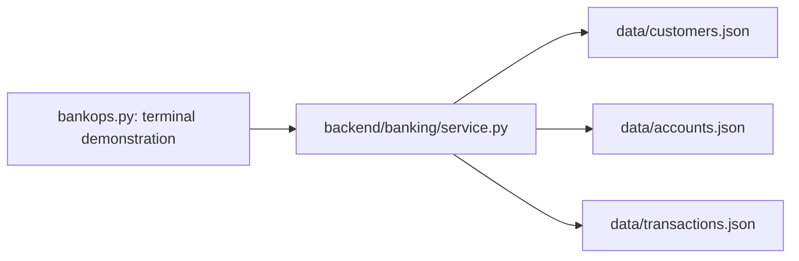

# BankOps AI

AI-Powered Banking Payment Investigation Assistant ? an incremental learning project using synthetic data only.

## Phase 2: Banking REST APIs

The JSON banking service is now accessible through FastAPI. Start here: [Phase 2 learning guide](docs/phase-2-guide.md).

Run in **PowerShell**, from the project root (exit the Python `>>>` prompt first):

```powershell
.\.venv\Scripts\python.exe -m pip install -r requirements-dev.txt
.\.venv\Scripts\python.exe -m uvicorn backend.main:app --reload --host 127.0.0.1 --port 8000
```

Open http://127.0.0.1:8000/docs for Swagger UI. Use a second terminal for commands and tests; stop the server with Ctrl+C.

```powershell
curl.exe -i http://127.0.0.1:8000/transactions/TXN001
.\.venv\Scripts\python.exe -m pytest -q
```

All routes are GET: `/health`, `/customers/{customer_id}`, `/customers/{customer_id}/accounts`, `/accounts/{account_id}`, `/accounts/{account_id}/transactions`, `/transactions/{transaction_id}`.

Missing resources (including parents of collections) return 404. Existing parents with no children return 200 and `[]`. Broken backing data returns 500. `/health` is application liveness, not a data readiness check. This is a local synthetic-data learning API; authentication is not implemented in this phase.

New files: `backend/main.py`, `backend/banking/routes.py`, `backend/banking/models.py`, `requirements.txt`, `tests/test_api.py`, and the Phase 2 guide. Development dependencies now include runtime dependencies and HTTPX for API tests. The Phase 1 demonstration still works.

## Phase 1: Python and JSON banking system

This milestone contains 10 fictional customers, 15 accounts, and 50 transactions. The service retrieves facts; it does not investigate causes or move money. Runtime code uses only the Python standard library. Use Python 3.10 or newer.



The current folder is the project root (the `bankops-ai/` folder in the requested layout).

```text
bankops-ai/
??? README.md
??? bankops.py
??? backend/
?   ??? __init__.py
?   ??? banking/
?       ??? __init__.py
?       ??? service.py
??? data/
?   ??? customers.json
?   ??? accounts.json
?   ??? transactions.json
??? docs/
?   ??? phase-1-guide.md
??? tests/
?   ??? test_service.py
??? test_bankops.py
??? requirements-dev.txt
??? .gitignore
```

Read [the beginner guide](docs/phase-1-guide.md) for explanations, manual tests, and interview questions.

## Run in PowerShell

From the project root:

```powershell
python bankops.py TXN001
```

Omitting the ID also retrieves TXN001. Expect ACC001, CUST001, AED 2,500.00, TRANSFER, and PROCESSING. This status alone does not explain a delay or prove beneficiary receipt.

For tests, create the environment if it does not already exist:

```powershell
python -m venv .venv
.\.venv\Scripts\python.exe -m pip install -r requirements-dev.txt
.\.venv\Scripts\python.exe -m pytest -q
```

## Data contract

| Function | Found | No match |
| --- | --- | --- |
| `get_customer(customer_id)` | Customer dictionary | `None` |
| `get_account(account_id)` | Account dictionary | `None` |
| `get_transaction(transaction_id)` | Transaction dictionary | `None` |
| `get_customer_accounts(customer_id)` | List of accounts | `[]` |
| `get_account_transactions(account_id)` | List of transactions | `[]` |

IDs are exact and case-sensitive. Each account belongs to one customer; each transaction references an existing account and that account's customer. Its currency matches the account currency. The duplicated transaction customer ID is included for learning and checked by tests.

All four supported currencies use integer minor units with 100 minor units per whole unit. Dates use ISO 8601 strings with a +04:00 offset. Every record is marked synthetic; names and activity are invented. No real customer information, credentials, account numbers, or external connections are used.

Transactions describe one account's debit activity. INTERNAL_TRANSFER is a category here; counterpart entries, balances, settlement, and double-entry accounting are not modeled. Statuses are simplified fixture values, not an implementation of banking processing rules.

Files are reloaded for each lookup, keeping the code simple and returning fresh objects. List results follow file order. The loader checks JSON structure and record IDs; automated tests check the supplied data's relationships and domain values. This is not a full validation system for arbitrary imported data.

Unreadable files, malformed JSON, invalid list/object structure, and missing or duplicate record IDs raise `BankingDataError`. The demonstration prints the error with exit code 2. Unknown transaction IDs exit with code 1; successful lookups exit with code 0.

## Common errors

- Cannot find `bankops.py`: run from the project root.
- `No module named backend`: use the root demonstration command rather than executing service.py directly.
- `No module named pytest`: install requirements with the same Python used for tests.
- Banking data error: check the named file exists and contains valid JSON. JSON requires double quotes and forbids trailing commas.
- No result: check the ID spelling and case.

## Milestone checkpoint

Completed: Phase 1 JSON foundation and Phase 2 REST API. Stop after Phase 2 until its behavior and learning checklist are confirmed.

Suggested Git commit: `feat: expose banking lookups through FastAPI with response models and tests`
