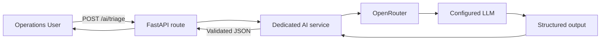
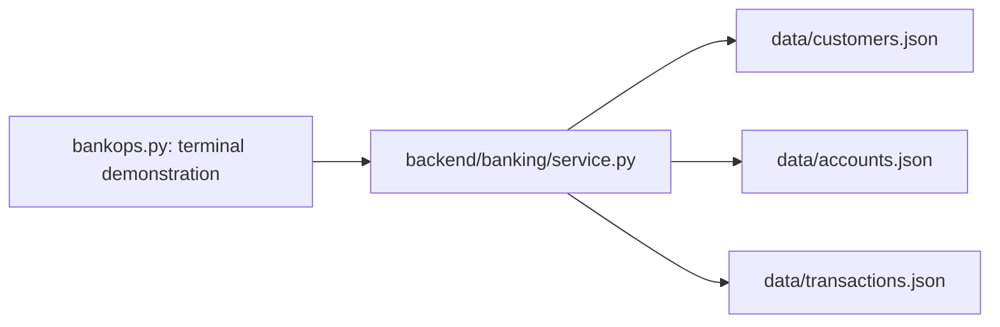

# BankOps AI

AI-Powered Banking Payment Investigation Assistant ? an incremental learning project using synthetic data only.

## Phase 3: LLM classification and extraction

`POST /ai/triage` classifies a synthetic complaint and extracts transaction_id, amount, and currency using OpenRouter structured outputs. It does not investigate or query banking records. See the [Phase 3 guide](docs/phase-3-guide.md) for concepts, local key setup, Swagger/PowerShell examples, and mocked versus live tests.

Copy `.env.example` to `.env` only if absent, enter your key locally, and install the updated requirements. Never commit or share `.env`. Banking endpoints still work without a key. Default tests do not make paid calls; the live test requires explicit opt-in.

## OpenRouter integration

OpenRouter connects the AI service to the configured language model through an OpenAI-compatible API. The project uses the `openai` Python SDK with base URL `https://openrouter.ai/api/v1`; requests go to `/chat/completions`. An OpenRouter key is required, rather than a direct OpenAI key.

The configured default model is `nex-agi/nex-n2.5-mini:free`. Model availability and provider limits can change. Keep a model that supports JSON-schema structured output when changing this setting.



### Local setup

Run from the project root in PowerShell. Create the virtual environment if it does not already exist:

```powershell
if (!(Test-Path .venv)) { python -m venv .venv }
.\.venv\Scripts\python.exe -m pip install -r requirements-dev.txt
if (!(Test-Path .env)) { Copy-Item .env.example .env }
```

Create an API key in your OpenRouter account. Open `.env` locally and configure:

```dotenv
OPENROUTER_API_KEY=your_openrouter_key_here
OPENROUTER_MODEL=nex-agi/nex-n2.5-mini:free
```

Replace the placeholder only in `.env`. Keep `.env.example` free of credentials. Git ignores `.env`; never paste keys into chat, screenshots, source code, or commits. If a key is exposed, revoke and replace it.

The service loads `.env` with `python-dotenv`. Existing terminal environment variables take precedence. Restart the server after changing configuration:

```powershell
.\.venv\Scripts\python.exe -m uvicorn backend.main:app --reload --host 127.0.0.1 --port 8000
```

### Test triage

Open http://127.0.0.1:8000/docs and use **POST /ai/triage**, or send this request from a second PowerShell terminal:

```powershell
$body = @{ message = 'Customer reports that transaction TXN001 for AED 2,500 was debited but the beneficiary has not received the payment.' } | ConvertTo-Json
Invoke-RestMethod -Method Post -Uri 'http://127.0.0.1:8000/ai/triage' -ContentType 'application/json' -Body $body | ConvertTo-Json
```

Expected extraction:

```json
{
  "issue_type": "payment_not_received",
  "transaction_id": "TXN001",
  "amount": 2500,
  "currency": "AED"
}
```

This describes the complaint, not verified banking facts. Amount uses whole currency units in this response; banking records use integer minor units. Unknown or ambiguous extracted fields may be `null`.

### Implementation and tests

- `backend/ai/routes.py` handles HTTP input and safe error responses.
- `backend/ai/service.py` sends separate system instructions and user content using `client.chat.completions.parse()`.
- `backend/ai/models.py` supplies the Pydantic response schema. The SDK returns parsed structured data rather than arbitrary prose.
- The request requires provider support for its parameters, disables reasoning for this basic extraction task, caps output at 500 tokens, and uses a 30-second timeout with no automatic retries.
- The service does not query banking records, investigate causes, or execute tools.

Run offline tests without credentials or provider calls:

```powershell
.\.venv\Scripts\python.exe -m pytest -q -m "not live"
```

Mocks verify application behavior and SDK schema handling; they do not prove model accuracy or live availability. To explicitly run the real-provider example:

```powershell
$env:RUN_LIVE_LLM_TESTS = '1'
.\.venv\Scripts\python.exe -m pytest -q -m live
Remove-Item Env:RUN_LIVE_LLM_TESTS
```

Live calls consume provider quota and may incur charges depending on the configured model. A model name ending in `:free` does not guarantee available capacity.

### OpenRouter troubleshooting

| Symptom | Meaning / next step |
| --- | --- |
| 503: key not configured | Set `OPENROUTER_API_KEY` in `.env`, not `.env.example`. |
| 503 with upstream 401 | OpenRouter rejected the supplied key; check the local configuration and restart. |
| 503 with upstream 429 | Account or provider rate/capacity limit; follow any reported retry delay. Changing a spending cap does not necessarily resolve request limits. |
| 504 | Provider request timed out. |
| 502 | Provider request failed or returned an incomplete/invalid structured result. |
| 422 | Invalid input or model refusal. |

If an old terminal value overrides `.env`, stop the server and remove the overrides before restarting:

```powershell
Remove-Item Env:OPENROUTER_API_KEY -ErrorAction SilentlyContinue
Remove-Item Env:OPENROUTER_MODEL -ErrorAction SilentlyContinue
```

These commands do not delete `.env`. Error handling uses safe messages and selected metadata rather than exposing raw provider responses or credentials.

References: [OpenRouter SDK integration](https://openrouter.ai/docs/guides/community/openai-sdk), [structured outputs](https://openrouter.ai/docs/guides/features/structured-outputs), [rate limits](https://openrouter.ai/docs/api/reference/limits).

## Phase 2: Banking REST APIs

The JSON banking service is now accessible through FastAPI. Start here: [Phase 2 learning guide](docs/phase-2-guide.md).

Run in **PowerShell**, from the project root (exit the Python `>>>` prompt first):

```powershell
.\.venv\Scripts\python.exe -m pip install -r requirements-dev.txt
.\.venv\Scripts\python.exe -m uvicorn backend.main:app --reload --host 127.0.0.1 --port 8000
```

Open http://127.0.0.1:8000/docs for Swagger UI. Use a second terminal for commands and tests; stop the server with Ctrl+C.

```powershell
curl.exe -i http://127.0.0.1:8000/transactions/TXN001
.\.venv\Scripts\python.exe -m pytest -q
```

All routes are GET: `/health`, `/customers/{customer_id}`, `/customers/{customer_id}/accounts`, `/accounts/{account_id}`, `/accounts/{account_id}/transactions`, `/transactions/{transaction_id}`.

Missing resources (including parents of collections) return 404. Existing parents with no children return 200 and `[]`. Broken backing data returns 500. `/health` is application liveness, not a data readiness check. This is a local synthetic-data learning API; authentication is not implemented in this phase.

New files: `backend/main.py`, `backend/banking/routes.py`, `backend/banking/models.py`, `requirements.txt`, `tests/test_api.py`, and the Phase 2 guide. Development dependencies now include runtime dependencies and HTTPX for API tests. The Phase 1 demonstration still works.

## Phase 1: Python and JSON banking system

This milestone contains 10 fictional customers, 15 accounts, and 50 transactions. The service retrieves facts; it does not investigate causes or move money. Runtime code uses only the Python standard library. Use Python 3.10 or newer.



The current folder is the project root (the `bankops-ai/` folder in the requested layout).

```text
bankops-ai/
??? README.md
??? bankops.py
??? backend/
?   ??? __init__.py
?   ??? banking/
?       ??? __init__.py
?       ??? service.py
??? data/
?   ??? customers.json
?   ??? accounts.json
?   ??? transactions.json
??? docs/
?   ??? phase-1-guide.md
??? tests/
?   ??? test_service.py
??? test_bankops.py
??? requirements-dev.txt
??? .gitignore
```

Read [the beginner guide](docs/phase-1-guide.md) for explanations, manual tests, and interview questions.

## Run in PowerShell

From the project root:

```powershell
python bankops.py TXN001
```

Omitting the ID also retrieves TXN001. Expect ACC001, CUST001, AED 2,500.00, TRANSFER, and PROCESSING. This status alone does not explain a delay or prove beneficiary receipt.

For tests, create the environment if it does not already exist:

```powershell
python -m venv .venv
.\.venv\Scripts\python.exe -m pip install -r requirements-dev.txt
.\.venv\Scripts\python.exe -m pytest -q
```

## Data contract

| Function | Found | No match |
| --- | --- | --- |
| `get_customer(customer_id)` | Customer dictionary | `None` |
| `get_account(account_id)` | Account dictionary | `None` |
| `get_transaction(transaction_id)` | Transaction dictionary | `None` |
| `get_customer_accounts(customer_id)` | List of accounts | `[]` |
| `get_account_transactions(account_id)` | List of transactions | `[]` |

IDs are exact and case-sensitive. Each account belongs to one customer; each transaction references an existing account and that account's customer. Its currency matches the account currency. The duplicated transaction customer ID is included for learning and checked by tests.

All four supported currencies use integer minor units with 100 minor units per whole unit. Dates use ISO 8601 strings with a +04:00 offset. Every record is marked synthetic; names and activity are invented. No real customer information, credentials, account numbers, or external connections are used.

Transactions describe one account's debit activity. INTERNAL_TRANSFER is a category here; counterpart entries, balances, settlement, and double-entry accounting are not modeled. Statuses are simplified fixture values, not an implementation of banking processing rules.

Files are reloaded for each lookup, keeping the code simple and returning fresh objects. List results follow file order. The loader checks JSON structure and record IDs; automated tests check the supplied data's relationships and domain values. This is not a full validation system for arbitrary imported data.

Unreadable files, malformed JSON, invalid list/object structure, and missing or duplicate record IDs raise `BankingDataError`. The demonstration prints the error with exit code 2. Unknown transaction IDs exit with code 1; successful lookups exit with code 0.

## Common errors

- Cannot find `bankops.py`: run from the project root.
- `No module named backend`: use the root demonstration command rather than executing service.py directly.
- `No module named pytest`: install requirements with the same Python used for tests.
- Banking data error: check the named file exists and contains valid JSON. JSON requires double quotes and forbids trailing commas.
- No result: check the ID spelling and case.

## Milestone checkpoint

Completed implementation: Phase 1 JSON foundation, Phase 2 REST API, and Phase 3 structured AI triage. Confirm Phase 3 live behavior and learning checklist before continuing.

Suggested Git commit: `feat: add structured LLM triage with isolated AI service and tests`
