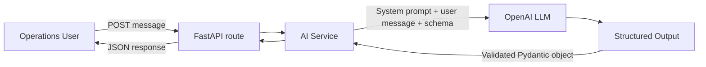

# Phase 3: first LLM integration

[Prerequisite questions, professional answers, and lessons learned](phase-3-qna.md)

## Selected model

The default is `nex-agi/nex-n2.5-mini:free` through OpenRouter. Reasoning is disabled for this single-turn extraction task. We retain strict structured outputs and parameter-aware routing. No reasoning history or second call is needed. The free endpoint is rate-limited; live tests still contact the provider. Changing the configured model may change costs and capabilities.

## What we built

POST /ai/triage accepts one synthetic Operations message and returns a classification plus explicitly stated transaction ID, amount, and currency. It does not read banking records, verify claims, investigate, recommend actions, or execute tools. Each request is independent.

## Concepts before running

| Concept | Meaning |
| --- | --- |
| LLM | A Large Language Model trained on language patterns to generate tokens. Here it interprets a complaint. It does not automatically know our transaction records. |
| Prompt | Instructions and information supplied to the model. |
| System prompt | Application-controlled instructions describing the extraction task and limits. |
| User prompt | The Operations complaint, passed separately as user-role content. |
| Tokens | Pieces of text, such as words, word fragments, or punctuation, used to measure input and output. Characters and tokens are not the same. |
| Context window | Capacity for the input and generated output of a request. This app sends no conversation history. |
| Temperature | Sampling variation setting. We use 0 for extraction; it is not a guarantee of correctness or perfect repeatability. |
| Hallucination | A plausible but unsupported statement or invented field. Missing facts should be null. |
| Structured output | A schema-constrained response. Predictable structure does not guarantee factual accuracy. |

## Architecture and code



- `backend/ai/models.py`: TriageRequest rejects blank messages, non-string inputs, extra fields, and messages longer than 4,000 characters. TriageResult describes the four returned fields. Every output key is required; nullable values represent missing or ambiguous information.
- `backend/ai/service.py`: loads local configuration, builds the prompt, calls `client.chat.completions.parse(response_format=TriageResult)`, and reads `response.choices[0].message.parsed`. The SDK generates the JSON schema and parses the structured response into Pydantic. We do not split or scrape arbitrary model prose.
- `backend/ai/routes.py`: receives validated input and translates safe service errors to HTTP responses. It contains no SDK call.
- `backend/main.py`: registers the AI router alongside the banking router.
- `.env.example`: blank key and configurable model name. `.env` is already excluded by Git.
- `tests/test_ai.py`: offline tests using a fake SDK client.
- `tests/test_ai_live.py`: explicitly enabled, paid live extraction check.

The model is configurable with OPENROUTER_MODEL, defaulting to nex-agi/nex-n2.5-mini:free, a model supporting structured outputs. The call uses temperature 0, a 500-output-token cap, a 30-second timeout, no automatic retries, and provider.require_parameters=True so routing requires support for the requested parameters. Requests go to https://openrouter.ai/api/v1/chat/completions using the OpenAI-compatible SDK. OpenRouter and the selected provider govern data handling. There are no tools or banking-service calls in the AI service.

The issue categories are payment_not_received, other, and unclear. Missing, unsupported, or ambiguous fields are null. Multiple transactions with no clear target are classified unclear, with null extracted fields. These are prompt instructions whose semantic accuracy still requires live evaluation.

Amount is a JSON number in whole currency units: 2500 means AED 2,500, not 250,000 fils. The float represents extracted information only; no money arithmetic occurs here. Our banking data continues using integer minor units. Any future financial processing must validate and convert the extraction first.

## Configuration and commands (PowerShell)

If the terminal shows >>>, enter exit() first. From the project root:

```powershell
.\.venv\Scripts\python.exe -m pip install -r requirements-dev.txt
if (!(Test-Path .env)) { Copy-Item .env.example .env }
```

Open `.env` in your editor. Enter your own OpenRouter API key after `OPENROUTER_API_KEY=` locally; never paste it into chat, commands, logs, or a committed file. The application reads `.env` with python-dotenv. Existing process environment values take precedence. Leave OPENROUTER_MODEL at its documented default initially. API requests require a usable OpenRouter account, model access, and available quota and may incur charges.

Verify ignore rules without displaying the key:

```powershell
git check-ignore .env
```

Expected: `.env`. Then run:

```powershell
.\.venv\Scripts\python.exe -m uvicorn backend.main:app --reload --host 127.0.0.1 --port 8000
```

Restart the server after changing configuration. The application and banking endpoints start without an API key; only AI requests require one. The app does not log keys or raw provider errors. Do not enable SDK/HTTP debug logging when working with credentials.

## Send a request

Open http://127.0.0.1:8000/docs, expand POST /ai/triage, select Try it out, and submit:

```json
{
  "message": "Customer reports that transaction TXN001 for AED 2,500 was debited but the beneficiary has not received the payment."
}
```

Or, from a second PowerShell terminal:

```powershell
$body = @{ message = 'Customer reports that transaction TXN001 for AED 2,500 was debited but the beneficiary has not received the payment.' } | ConvertTo-Json
Invoke-RestMethod -Method Post -Uri 'http://127.0.0.1:8000/ai/triage' -ContentType 'application/json' -Body $body | ConvertTo-Json
```

Expected semantic result (2500.0 and 2500 represent the same numeric amount):

```json
{
  "issue_type": "payment_not_received",
  "transaction_id": "TXN001",
  "amount": 2500,
  "currency": "AED"
}
```

This means the user reported those details, not that our system verified them.

## Five manual tests

1. Submit the example above. Expect payment_not_received, TXN001, 2500, AED.
2. Submit `The beneficiary has not received the payment.` Expect payment_not_received with all other fields null; the system should not guess TXN001 or AED.
3. Submit `Please help.` Expect unclear and null fields.
4. Submit an empty or whitespace-only message. Expect HTTP 422 before any provider call.
5. Submit `Transaction TXN999 for USD 75 was not received by the beneficiary.` Expect extraction of TXN999, USD, 75 despite TXN999 not existing in our JSON. This demonstrates extraction rather than investigation.

Cases 1, 2, 3, and 5 make real paid API calls. They are desired model behavior to verify, not evidence from mocked tests.

## Automated testing: mocked versus live

```powershell
.\.venv\Scripts\python.exe -m pytest -q -m "not live"
```

Offline tests replace the SDK client and disable dotenv loading. They work without an API key or network and verify validation, schema usage, prompt roles, null results, error mappings, and preservation of earlier banking behavior. They do NOT measure real model accuracy. A plain pytest run also skips the live test unless RUN_LIVE_LLM_TESTS=1.

To deliberately make one live paid call after configuring `.env`:

```powershell
$env:RUN_LIVE_LLM_TESTS = '1'
.\.venv\Scripts\python.exe -m pytest -q -m live
Remove-Item Env:RUN_LIVE_LLM_TESTS
```

The live test invokes the real AI service on the synthetic example and checks the result. No Uvicorn server is needed. It can fail due to credentials, model availability, quota, connectivity, or extraction quality. One passing example is not a comprehensive evaluation.

## Common errors

| Code | Meaning |
| --- | --- |
| 422 | Invalid request, or the model declined the message; inspect the safe detail. |
| 503 | Missing configuration, rejected provider credentials, or rate/quota limits. |
| 504 | Provider timeout. |
| 502 | Provider failure, incomplete result, or invalid/missing structured output. |

The key never belongs in the request body. HTTP error details deliberately omit raw provider errors. A valid schema can still contain incorrect extraction: compare results with the original complaint.

## Learning checklist and five interview questions

- [ ] Explain how an LLM differs from a transaction database.
- [ ] Distinguish system instructions from user content.
- [ ] Explain tokens, context limits, and why temperature 0 is not a correctness guarantee.
- [ ] Explain why structured outputs prevent many formatting problems but not hallucinations.
- [ ] Explain what mocked tests prove versus what requires a real model call.

1. Why does the route delegate the model call to a dedicated service?
2. Why do we pass system instructions and the complaint as separate messages?
3. Why should an absent amount or currency be null rather than guessed?
4. What does a Pydantic schema guarantee, and what can it not guarantee?
5. Why should TXN999 be extractable even when it does not exist in the banking data?

## Milestone boundary

Phase 3 only: basic classification and extraction with structured output. Stop here for review and confirmation. Tool calling and investigation remain future work.

Suggested commit: `feat: add structured LLM triage with isolated AI service and tests`

Official references: [Structured outputs](https://openrouter.ai/docs/guides/features/structured-outputs), [Model capabilities](https://openrouter.ai/nex-agi/nex-n2.5-mini:free).
